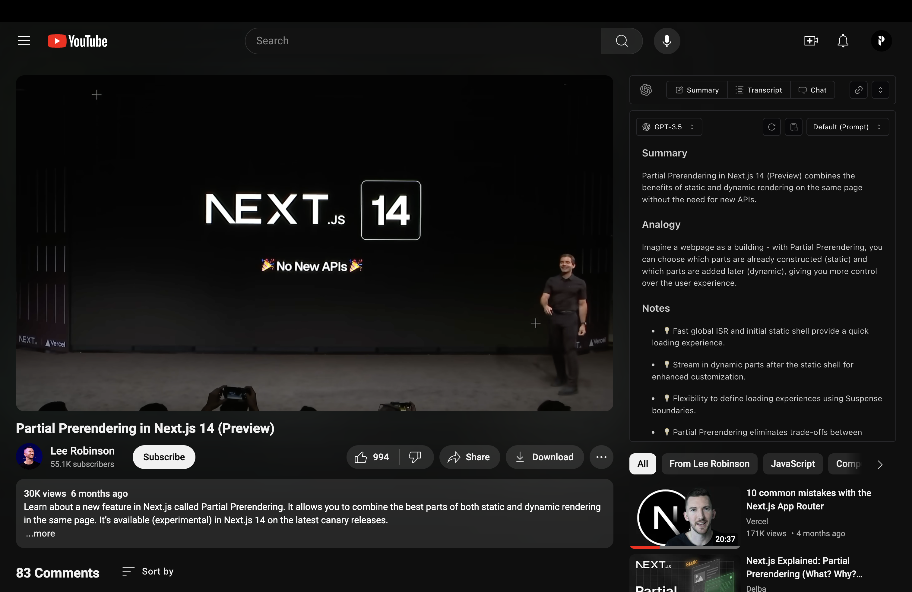

<h1 align="center">MOVA: AI Translation Chrome Extension</h1>

<p align="center" style="padding: 20px 0;">
MOVA is an AI-powered translation Chrome extension that helps you seamlessly translate text in multiple languages.
</p>

<p align="center">
  <a href="https://www.loom.com/share/6eed3f7bcd9b44b985693791635e3010?sid=34459245-ec9a-43df-8fa7-b98c924ade8c"><strong>Demo Video</strong></a> ·
  <a href="#features"><strong>Features</strong></a> ·
  <a href="#roadmap"><strong>Roadmap</strong></a> ·
  <a href="#installation"><strong>Installation</strong></a> ·
  <a href="#acknowledgments"><strong>Acknowledgments</strong></a>
</p>
<br/>

## Features

- Open-source AI models for cost-effective translation
- YouTube video dubbing and subtitle generation in multiple languages
- Caching database for faster access and improved efficiency
- User-friendly interface integrated directly into Chrome
- Support for multiple languages and real-time translation

## Roadmap

- Expand language model support
- Add more translation providers
- Improve caching performance
- Enhanced YouTube integration features

## Installation

To install and run the MOVA Chrome Extension locally, follow these steps:

1. Clone the repository:

   ```bash
   git clone https://github.com/VDuda/mova-youtube-ai-extension.git

   cd mova-youtube-ai-extension
   ```

2. Add your OpenAI API key. Replace `YOUR_API_KEY` with your actual key in the files `chat.ts` and `completion.ts`

   ```typescript
   const openai = new OpenAI({
     apiKey: "YOUR_API_KEY"
   })
   ```

3. Install the dependencies and build the project:

   ```bash
   pnpm install
   pnpm build
   ```

4. Load the extension in Chrome:
   - Go to `chrome://extensions/`
   - Enable "Developer mode"
   - Click "Load unpacked"
   - Select the `build/chrome-mv3-dev` directory

   5. Open YouTube.com


## Acknowledgments

Special thanks to:

- [OpenAI](https://openai.com)
- [Tailwind CSS](https://tailwindcss.com)
- [Plasmo Extension](https://www.plasmo.com)
- [Chrome Extension Documentation](https://developer.chrome.com/docs/extensions/)
